# PortalWissensmanagement - ER-Diagramm

> 13 Entitaeten + 1 Join-Tabelle | Stand: 2026-03-29

```mermaid
---
title: PortalWissensmanagement - Entity-Relationship-Diagramm
---
erDiagram

    %% ============================================================
    %% ARTIKEL & HIERARCHIE
    %% ============================================================

    wm_articles {
        UUID id PK
        VARCHAR tenant_id "NOT NULL"
        VARCHAR500 title "NOT NULL"
        TEXT content
        VARCHAR2000 summary
        VARCHAR20 status "DRAFT/PUBLISHED/ARCHIVED"
        UUID category_id FK
        UUID grouping_id FK
        VARCHAR created_by
        VARCHAR updated_by
        TIMESTAMP created_at
        TIMESTAMP updated_at
        INT version "DEFAULT 1"
        BOOLEAN public_within_tenant
        VARCHAR linked_task_id
        INT view_count "DEFAULT 0"
        INT usage_count "DEFAULT 0"
        INT rating_sum "DEFAULT 0"
        INT rating_count "DEFAULT 0"
        TIMESTAMP last_used_at
        UUID parent_article_id FK "self-ref"
        INT sort_order "DEFAULT 0"
        VARCHAR4000 tree_path
        INT depth "DEFAULT 0"
        VARCHAR organization_unit_id
    }

    wm_article_versions {
        UUID id PK
        UUID article_id FK "NOT NULL"
        INT version "NOT NULL"
        VARCHAR500 title
        TEXT content
        VARCHAR2000 summary
        VARCHAR changed_by
        TIMESTAMP changed_at
        VARCHAR500 change_note
    }

    wm_article_tags {
        UUID article_id FK
        UUID tag_id FK
    }

    wm_articles ||--o{ wm_articles : "parent/children (Hierarchie)"
    wm_articles ||--o{ wm_article_versions : "Versionen"
    wm_articles }o--o{ wm_tags : "wm_article_tags"

    %% ============================================================
    %% KATEGORIEN, TAGS, GRUPPIERUNGEN
    %% ============================================================

    wm_categories {
        UUID id PK
        VARCHAR tenant_id "NOT NULL"
        VARCHAR200 name "NOT NULL, UNIQUE(tenant,name)"
        TEXT description
        VARCHAR36 parent_id FK "self-ref"
        INT order_index "DEFAULT 0"
        VARCHAR organization_unit_id
        TIMESTAMP created_at
        TIMESTAMP updated_at
    }

    wm_tags {
        UUID id PK
        VARCHAR tenant_id "NOT NULL"
        VARCHAR100 name "NOT NULL, UNIQUE(tenant,name)"
        TIMESTAMP created_at
    }

    wm_groupings {
        UUID id PK
        VARCHAR tenant_id "NOT NULL"
        VARCHAR200 name "NOT NULL, UNIQUE(tenant,name)"
        VARCHAR500 description
        TIMESTAMP created_at
    }

    wm_articles }o--o| wm_categories : "Kategorie"
    wm_articles }o--o| wm_groupings : "Gruppierung"
    wm_categories }o--o| wm_categories : "parent (Hierarchie)"

    %% ============================================================
    %% RAG: CHUNKS
    %% ============================================================

    wm_chunks {
        UUID id PK
        VARCHAR tenant_id "NOT NULL"
        UUID article_id FK "NOT NULL"
        INT chunk_index "NOT NULL"
        TEXT content "NOT NULL"
        INT token_count
        VARCHAR500 heading
        VARCHAR500 article_title
        TEXT metadata
        VARCHAR20 embedding_status "DEFAULT PENDING"
        TIMESTAMP created_at
    }

    wm_articles ||--o{ wm_chunks : "Chunks (RAG)"

    %% ============================================================
    %% FEEDBACK & ANALYTICS
    %% ============================================================

    wm_feedback {
        UUID id PK
        UUID article_id FK "NOT NULL"
        VARCHAR user_id "NOT NULL"
        VARCHAR tenant_id "NOT NULL"
        INT rating "CHECK 1-5"
        TEXT comment
        TIMESTAMP created_at
    }

    wm_usage {
        UUID id PK
        UUID article_id FK "NOT NULL"
        VARCHAR tenant_id "NOT NULL"
        VARCHAR50 context_type
        VARCHAR context_reference_id
        VARCHAR used_by "NOT NULL"
        TIMESTAMP used_at "NOT NULL"
    }

    wm_suggestions {
        UUID id PK
        VARCHAR tenant_id "NOT NULL"
        VARCHAR50 context_type
        VARCHAR context_ref_id
        UUID article_id FK
        DOUBLE confidence
        VARCHAR500 reason
        TIMESTAMP created_at
    }

    wm_articles ||--o{ wm_feedback : "Bewertungen"
    wm_articles ||--o{ wm_usage : "Nutzungsanalyse"
    wm_articles ||--o{ wm_suggestions : "Vorschlaege"

    %% ============================================================
    %% CHAT (RAG-basiert)
    %% ============================================================

    wm_chat_sessions {
        UUID id PK
        VARCHAR tenant_id "NOT NULL"
        VARCHAR user_id "NOT NULL"
        VARCHAR model_config_id
        VARCHAR300 title
        VARCHAR50 context_type
        VARCHAR context_ref_id
        VARCHAR organization_unit_id
        TIMESTAMP created_at
        TIMESTAMP updated_at
    }

    wm_chat_messages {
        UUID id PK
        UUID session_id FK "NOT NULL"
        VARCHAR10 role "USER/ASSISTANT/SYSTEM"
        TEXT content "NOT NULL"
        TEXT source_refs "JSON"
        VARCHAR model_id
        INT token_count
        TIMESTAMP created_at
    }

    wm_chat_sessions ||--o{ wm_chat_messages : "Nachrichten"

    %% ============================================================
    %% PROMPT-VERWALTUNG
    %% ============================================================

    wm_prompt_configs {
        UUID id PK
        VARCHAR tenant_id "NOT NULL"
        VARCHAR200 name "NOT NULL"
        VARCHAR1000 description
        TEXT prompt_text "NOT NULL"
        VARCHAR20 prompt_type "SUMMARY/CONTENT"
        UUID category_id FK
        BOOLEAN is_active "DEFAULT true"
        INT sort_order "DEFAULT 0"
        TIMESTAMP created_at
        TIMESTAMP updated_at
    }

    wm_prompt_categories {
        UUID id PK
        VARCHAR tenant_id "NOT NULL"
        VARCHAR200 name "NOT NULL"
        VARCHAR500 description
        INT sort_order "DEFAULT 0"
        TIMESTAMP created_at
        TIMESTAMP updated_at
    }

    wm_prompt_configs }o--o| wm_prompt_categories : "Kategorie"
```

## Beziehungsuebersicht

| Von | Nach | Typ | Beschreibung |
|-----|------|-----|--------------|
| KnowledgeArticle | KnowledgeArticle | 1:n | Hierarchie (parent/children), Baumstruktur |
| KnowledgeArticle | KnowledgeCategory | n:1 | Kategoriezuordnung (optional) |
| KnowledgeArticle | KnowledgeGrouping | n:1 | Gruppierungszuordnung (optional) |
| KnowledgeArticle | KnowledgeTag | n:m | Tags via `wm_article_tags` |
| KnowledgeArticle | KnowledgeChunk | 1:n | RAG-Chunks fuer Retrieval |
| KnowledgeArticle | ArticleVersion | 1:n | Versionshistorie |
| KnowledgeArticle | KnowledgeFeedback | 1:n | Bewertungen (1 pro User) |
| KnowledgeArticle | KnowledgeUsage | 1:n | Nutzungsanalyse |
| KnowledgeArticle | KnowledgeSuggestion | 1:n | KI-Vorschlaege |
| KnowledgeCategory | KnowledgeCategory | 1:n | Hierarchische Kategorien |
| ChatSession | ChatMessage | 1:n | Chat-Nachrichten |
| PromptConfig | PromptCategory | n:1 | Prompt-Kategorisierung |

## Domaenenbereiche

| Bereich | Tabellen | Beschreibung |
|---------|----------|--------------|
| **Artikelverwaltung** | `wm_articles`, `wm_article_versions`, `wm_article_tags` | Hierarchische Artikel mit Versionierung |
| **Taxonomie** | `wm_categories`, `wm_tags`, `wm_groupings` | Kategorien, Tags, Gruppierungen |
| **RAG** | `wm_chunks` | Dokumenten-Chunks fuer Retrieval-Augmented Generation |
| **Feedback & Analytics** | `wm_feedback`, `wm_usage`, `wm_suggestions` | Bewertungen, Nutzungstracking, KI-Vorschlaege |
| **Chat** | `wm_chat_sessions`, `wm_chat_messages` | RAG-basierter Chat mit Session-Management |
| **Prompts** | `wm_prompt_configs`, `wm_prompt_categories` | Verwaltbare Prompt-Templates |

## Indizes

| Tabelle | Index | Typ |
|---------|-------|-----|
| wm_articles | Tenant + Status | B-Tree |
| wm_articles | Tenant + Category | B-Tree |
| wm_articles | parent_article_id, sort_order | B-Tree (Hierarchie) |
| wm_articles | tree_path | B-Tree (Baum-Queries) |
| wm_articles | Fulltext (title, content, summary) | GIN (German Stemming) |
| wm_chunks | Fulltext (content) | GIN (German Stemming) |
| wm_chunks | Trigram Similarity | GIN (pg_trgm) |
| wm_chat_sessions | Tenant + User | B-Tree |
